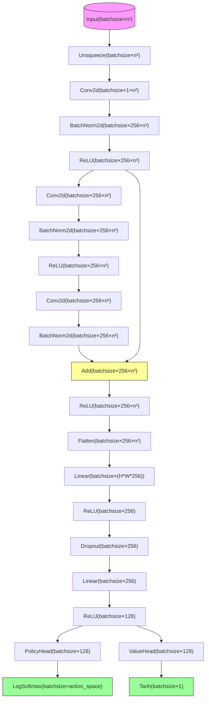

# 人工智能导论第3次作业

<center>
    姓名：李炎佳 	学号：2022030078	班级：软33
</center>


## 简答题

1.

**交叉熵定义**：

给定两个概率分布 $ p $ 和 $ q $，$ p $ 相对于 $ q $ 的交叉熵定义为：

$$
H(p, q) = E_p[-\log q] = H(p) + D_{KL}(p \| q)
$$

其中：
- $ H(p) $ 是 $ p $ 的熵，
- $ D_{KL}(p \| q) $ 是从 $ p $ 到 $ q $ 的 KL 散度（也称为 $ p $ 相对于 $ q $ 的相对熵）。

**离散分布形式**

对于离散分布 $ p $ 和 $ q $，交叉熵表示为：

$$
H(p, q) = -\sum_x p(x) \log q(x)
$$

**连续分布形式**

对于连续分布，假设 $ p $ 和 $ q $ 在测度 $ r $ 上是绝对连续的（通常 $ r $ 是 Borel σ-代数上的 Lebesgue 测度）。设 $ P $ 和 $ Q $ 分别为 $ p $ 和 $ q $ 的概率密度函数，则交叉熵为：

$$
-\int_X P(x) \log Q(x) \, dr(x) = E_p[-\log Q]
$$

- $ E_p[\cdot] $: 基于分布 $ p $ 的期望。
- $ \log $: 自然对数（以 $ e $ 为底）。
- $ D_{KL}(p \| q) $: KL 散度，衡量分布 $ p $ 和 $ q $ 的差异。

**绝对值损失定义**：
$$
L_{\text{abs}} = \sum_{i} |y_i - \hat{y}_i|
$$

**交叉熵的优势**：

- 交叉熵的梯度与误差成正比（$\nabla_{\hat{y}} L \propto (y - \hat{y})$），梯度更新更直接，适合梯度下降优化。而绝对值损失的梯度是常数（$\pm 1$），无法根据误差大小动态调整，优化效率低。
- 交叉熵是凸函数，保证梯度下降能找到全局最优解，而绝对值损失在分类问题中可能导致非凸优化问题。

2.

**MLP 相比线性模型的优势**：

- 非线性建模：MLP可以通过ReLu等激活函数引入非线性变换，使其能够逼近任意连续函数，具有更强大的建模能力
- 更强的表达能力：MLP通过增加隐藏层和神经元数量，可以灵活调整模型容量，适用于高维数据和大规模任务。而线性模型的表达能力受限于输入特征的线性组合，难以处理高复杂度问题。

**窄而深的神经网络的好处**：

- 参数利用更加高效：窄而深的网络通过逐层抽象，能够以更少的参数学到更复杂的特征表示。相比之下，浅而宽的网络需要大量神经元来拟合相同复杂度的函数，导致参数冗余和计算浪费。
- 层次化特征学习：深度网络通过多个非线性层逐步提取低层到高层的特征，符合自然数据的层次化结构。而浅层网络难以有效建模这种层次化特征，可能影响模型性能。
- 泛化能力更好：深度网络通过正则化技术（如Dropout、BatchNorm）和残差连接（ResNet）缓解过拟合，而浅层宽网络因参数量大更容易过拟合，尤其在数据量不足时表现更差。

3.

 对两个函数 $f$ 和 $g$

连续和离散卷积运算定义为：  
$$
(f*g)(t)=\int_{-\infty}^\infty f(\tau)g(t-\tau)\mathrm{d}\tau\\
(f * g)(n) = \sum_{m=-\infty}^{\infty} f(m) \cdot g(n - m)
$$
连续和离散互相关运算定义为：  
$$
\begin{gathered}
(f\star g)(n)=\sum_{m=-\infty}^\infty\overline{f(m)}g(m+n) \\
[f(t)\star g(t)](t)=[\overline{f(-t)}*g(t)](t)
\end{gathered}
$$
在CNN中，卷积层实际执行的是互相关（Cross-correlation）操作，而非严格数学定义的卷积。
这是因为CNN的卷积核本身就是通过数据学习得到的，学习过程中核会自动适应方向，翻转操作是冗余的。且互相关直接计算输入与核的局部相似性，物理意义更明确。


4.

不一致。

1. 当优化器为带动量的优化器时，原batch的动量更新基于单次梯度g，而梯度更新后动量更新基于两次小batch的累计梯度 g_1 + g_2，对称动量状态便宜，参数更新方向不同

2. 此外，当模型当中存在Batch Normalization层时，原先大batch的BN统计量为$\mu_B, \sigma_B^2$，而两次小batch的统计量分别为 $\mu_{B/2}^{(1)}，(\sigma_{B/2}^{(1)})^2$和$\mu_{B/2}^{(2)}，(\sigma_{B/2}^{(2)})^2$，由于 $\mu_B \ne 1/2(\mu_{B/2}^{(1)} + \mu_{B/2}^{(2)})$，前向传播的输出不同，导致梯度计算存在偏差

5.

**残差连接如何帮助训练更深层的网络？**
在传统深层网络中，反向传播的梯度需要通过链式法则逐层传递。如果每一层的梯度值较小（例如由于激活函数饱和或权重初始化不当），深层网络的梯度会呈现指数级衰减，导致底层的参数几乎无法更新。这种现象称为**梯度消失**。  

残差连接通过引入跨层的直连路径，改变了梯度的传播方式。具体来说，残差块的输出可以表示为：  
$$
y = F(x) + x
$$


其中，$ F(x) $ 是神经网络需要学习的残差函数，而 $ x $ 是输入的直接映射。在反向传播时，梯度计算变为：  
$$
\frac{\partial y}{\partial x} = \frac{\partial F(x)}{\partial x} + 1
$$
即使 $ \frac{\partial F(x)}{\partial x} $ 接近于 0（即梯度消失），由于存在 $ +1 $ 项，梯度仍然能够有效回传到底层。这一机制相当于在反向传播时提供了一条低阻力的梯度通路，使得深层网络的训练更加稳定。  

**残差连接能否缓解梯度消失？** 
是的，残差连接能够显著缓解梯度消失问题，因为① 残差路径（即 $ +x $ 部分）提供了一条不受非线性变换影响的梯度传播路径，确保梯度能够直接回传到底层，避免因多层累积导致的梯度衰减。  ② 残差网络具有梯度的数值稳定性。在传统网络中，如果某一层的梯度 $ \frac{\partial F(x)}{\partial x} $ 接近于 -1，梯度会迅速衰减至 0；而在残差网络中，由于存在 $ +1 $ 项，梯度仍然能够保持合理的幅度（例如 $ -0.9 + 1 = 0.1 $），使得反向传播更加稳定。  


## 解答题

### 2.1 卷积神经网络

1.
$$
卷积核总参数数 = 5 \times 5 \times 3 = 75
$$
2.
$$
卷积层输出尺寸 = \frac{55-5}{2} +1 = 26 \times 26 \times 3
$$

$$
最大池化层输出尺寸 = \frac{26-2}{2} +1 = 13 \times 13 \times 3
$$

3.

ReLU作用于池化之后的每个激活值，故
$$
ReLU计算次数 = 13 \times 13 \times 3 = 507
$$


4.

ReLU 函数：
$$
f(x) = max(0, x)
$$
Sigmoid 函数:
$$
f(x) = \frac{1}{1 + e^{-x}}
$$

### 2.2 注意力机制

1.
自注意力层的输出 $ y_i $ 的表达式为：  
$$
y_i = \sum_{j=1}^3 \frac{\exp\left(\frac{q_i k_j^T}{\sqrt{d}}\right)}{\sum_{l=1}^3 \exp\left(\frac{q_i k_l^T}{\sqrt{d}}\right)} v_j, \quad i = 1, 2, 3
$$
其中，Softmax对每行归一化，权重表示当前token $ q_i $ 对其他token $ k_j $ 的关注程度。

2.
（1）$ q_3 $ 的取值 
为使 $ q_3 $ 与 $ k_1 $ 的注意力权重最大，需满足：  
$$
q_3 k_1^T > q_3 k_2^T \quad \text{且} \quad q_3 k_1^T > q_3 k_3^T
$$
已知 $ k_1 = [0, 1, -1, 0]^T $，$ k_2 = [1, 0, -1, 1]^T $，$ k_3 = [0, -1, 0, -1]^T $。  

选择 $ q_3 = [1, 0, 0, 0] $（满足 $ \|q_3\|_2 = 1 $）： 

- $q_3 k_1^T = 1 \times 0 + 0 \times 1 + 0 \times (-1) + 0 \times 0 = 0 $  

- $ q_3 k_2^T = 1 \times 1 + 0 \times 0 + 0 \times (-1) + 0 \times 1 = 1 $  

- $ q_3 k_3^T = 1 \times 0 + 0 \times (-1) + 0 \times 0 + 0 \times (-1) = 0 $  

此时 $ q_3 k_2^T $ 最大，但题目要求 $ q_3 $ 与 $ k_1 $ 的权重最大，因此需调整。 
修正方案： 
选择 $ q_3 = [0, 1, 0, 0] $： 

- $q_3 k_1^T = 1 $（最大），$ q_3 k_2^T = 0 $，$ q_3 k_3^T = -1 $。  

满足 $ q_3 k_1^T > q_3 k_2^T $ 且 $ q_3 k_1^T > q_3 k_3^T $，且 $ \|q_3\|_2 = 1 $。  

最终取值：  
$$
q_3 = [0, 1, 0, 0]
$$

（2）$ y_3 $ 的表达式 
计算注意力权重（$ d = 4 $，$ \sqrt{d} = 2 $）：  
$$
\text{Softmax输入} = \frac{q_3 K^T}{2} = \frac{[0, 1, 0, 0] K}{2} = \frac{[1, 0, -1]}{2}
$$
Softmax归一化：  
$$
\text{权重} = \left[\frac{e^{0.5}}{e^{0.5} + e^0 + e^{-0.5}}, \frac{e^0}{e^{0.5} + e^0 + e^{-0.5}}, \frac{e^{-0.5}}{e^{0.5} + e^0 + e^{-0.5}}\right]
$$
因此：  
$$
y_3 = \frac{e^{0.5}}{S} v_1 + \frac{e^0}{S} v_2 + \frac{e^{-0.5}}{S} v_3, \quad S = e^{0.5} + e^0 + e^{-0.5}
$$
化简后：  
$$
y_3 = \frac{e^{0.5}}{e^{0.5} + 1 + e^{-0.5}} v_1 + \frac{1}{e^{0.5} + 1 + e^{-0.5}} v_2 + \frac{e^{-0.5}}{e^{0.5} + 1 + e^{-0.5}} v_3
$$

3.
问题重述

我们需要解决的问题是基于给定的多头自注意力机制设置，找到一个满足特定条件的query向量 $ q_4 $，并计算对应的输出 $ y_4 $。具体条件如下：

1. 多头自注意力设置：
 - 假设query、key、value向量的前两维和后两维分别作为两个自注意力头（Head 1和Head 2）的特征向量。

 - 即：

     ◦ Head 1: 使用前两维 $ q^{(1)} = q_{[1:2]} $, $ k^{(1)} = k_{[1:2]} $, $ v^{(1)} = v_{[1:2]} $

     ◦ Head 2: 使用后两维 $ q^{(2)} = q_{[3:4]} $, $ k^{(2)} = k_{[3:4]} $, $ v^{(2)} = v_{[3:4]} $


2. 条件：
 - $ q_4 $ 的2范数不超过1：$ \|q_4\|_2 \leq 1 $

 - 在Head 1中，$ q_4 $ 与第二个token（“喜欢”）的key $ k_2 $ 的自注意力权重最大（相比其他token）。

 - 在Head 2中，$ q_4 $ 与第四个token（“He”）的key $ k_4 $ 的自注意力权重最大（相比其他token）。


3. 输出：
 - 找到满足条件的 $ q_4 $ 的一个取值。

 - 写出此时 $ y_4 $ 的表达式。


解决步骤

1. 自注意力权重计算
自注意力权重的计算公式为：
$$ \text{AttentionWeight}(q, k_i) = \frac{\exp(q \cdot k_i)}{\sum_j \exp(q \cdot k_j)} $$

为了使 $ q $ 对某个 $ k_i $ 的注意力权重最大，需要 $ q \cdot k_i $ 最大（因为softmax是单调的）。

2. Head 1的条件
在Head 1（前两维）中，$ q_4^{(1)} $ 需要与 $ k_2^{(1)} $ 的点积最大：
$$ q_4^{(1)} \cdot k_2^{(1)} > q_4^{(1)} \cdot k_j^{(1)} \quad \forall j \neq 2 $$

为了实现这一点，可以设 $ q_4^{(1)} = k_2^{(1)} $，因为点积 $ k_2^{(1)} \cdot k_2^{(1)} $ 是最大的（假设其他 $ k_j^{(1)} $ 不与 $ k_2^{(1)} $ 完全一致）。

3. Head 2的条件
在Head 2（后两维）中，$ q_4^{(2)} $ 需要与 $ k_4^{(2)} $ 的点积最大：
$$ q_4^{(2)} \cdot k_4^{(2)} > q_4^{(2)} \cdot k_j^{(2)} \quad \forall j \neq 4 $$

类似地，可以设 $ q_4^{(2)} = k_4^{(2)} $。

4. 构造 $ q_4 $
因此，可以构造：
$$ q_4 = \begin{bmatrix} q_4^{(1)} \\ q_4^{(2)} \end{bmatrix} = \begin{bmatrix} k_2^{(1)} \\ k_4^{(2)} \end{bmatrix} $$

5. 2范数约束
需要 $ \|q_4\|_2 \leq 1 $。假设 $ k_2^{(1)} $ 和 $ k_4^{(2)} $ 的2范数满足：
$$ \|k_2^{(1)}\|_2^2 + \|k_4^{(2)}\|_2^2 \leq 1 $$

如果 $ k_2^{(1)} $ 和 $ k_4^{(2)} $ 的2范数较大，可以对 $ q_4 $ 进行归一化：
$$ q_4 = \frac{1}{\sqrt{\|k_2^{(1)}\|_2^2 + \|k_4^{(2)}\|_2^2}} \begin{bmatrix} k_2^{(1)} \\ k_4^{(2)} \end{bmatrix} $$

6. $ y_4 $ 的计算
多头自注意力的输出是各头输出的拼接（或加权和）。假设是拼接：
$$ y_4 = \text{AttentionHead}_1(q_4, K, V) \oplus \text{AttentionHead}_2(q_4, K, V) $$

其中：
• $ \text{AttentionHead}_1(q_4, K, V) = \sum_j \alpha_j^{(1)} v_j^{(1)} $，其中 $ \alpha_j^{(1)} $ 是Head 1的注意力权重。

- 根据条件，$ \alpha_2^{(1)} $ 最大（接近1，其他接近0），因此 $ \text{AttentionHead}_1 \approx v_2^{(1)} $。

• $ \text{AttentionHead}_2(q_4, K, V) = \sum_j \alpha_j^{(2)} v_j^{(2)} $。

- 根据条件，$ \alpha_4^{(2)} $ 最大（接近1，其他接近0），因此 $ \text{AttentionHead}_2 \approx v_4^{(2)} $。


因此：
$$ y_4 \approx \begin{bmatrix} v_2^{(1)} \\ v_4^{(2)} \end{bmatrix} $$

7. 具体取值
  假设：

- $ k_2^{(1)} = (a, b)^T $

- $ k_4^{(2)} = (c, d)^T $

且 $ a^2 + b^2 + c^2 + d^2 \leq 1 $，则可以设：
$$ q_4 = \begin{bmatrix} a \\ b \\ c \\ d \end{bmatrix} $$

此时：
• Head 1的注意力权重：

- $ q_4^{(1)} \cdot k_2^{(1)} = a^2 + b^2 $

- $ q_4^{(1)} \cdot k_j^{(1)} $ 对其他 $ j $ 会更小（除非其他 $ k_j^{(1)} $ 与 $ k_2^{(1)} $ 相同）。

• Head 2的注意力权重：

- $ q_4^{(2)} \cdot k_4^{(2)} = c^2 + d^2 $

- $ q_4^{(2)} \cdot k_j^{(2)} $ 对其他 $ j $ 会更小（除非其他 $ k_j^{(2)} $ 与 $ k_4^{(2)} $ 相同）。


输出：
$$ y_4 = \begin{bmatrix} v_2^{(1)} \\ v_4^{(2)} \end{bmatrix} $$

示例解答

假设：
• $ k_2^{(1)} = (1, 0)^T $

• $ k_4^{(2)} = (0, -1)^T $（根据第2张图，$ k_4 = (-1, 0, -1, -1)^T $，因此 $ k_4^{(2)} = (-1, -1)^T $）

• 需要 $ \|q_4\|_2 \leq 1 $，因此可以设：

- $ q_4^{(1)} = k_2^{(1)} = (1, 0)^T $

- $ q_4^{(2)} = k_4^{(2)} / \|k_4^{(2)}\|_2 = (-1, -1)^T / \sqrt{2} $

- 这样 $ \|q_4\|_2 = \sqrt{1 + 0 + 1/2 + 1/2} = \sqrt{2} > 1 $，需要调整。


更合理的 $ q_4 $：
设 $ q_4^{(1)} = \alpha k_2^{(1)} $, $ q_4^{(2)} = \beta k_4^{(2)} $，且 $ \alpha^2 \|k_2^{(1)}\|_2^2 + \beta^2 \|k_4^{(2)}\|_2^2 \leq 1 $。

假设 $ k_2^{(1)} = (1, 0)^T $, $ k_4^{(2)} = (-1, -1)^T $，则：
$$ \alpha^2 \cdot 1 + \beta^2 \cdot 2 \leq 1 $$
可以选 $ \alpha = 1/\sqrt{3} $, $ \beta = 1/\sqrt{3} $：
$$ q_4 = \begin{bmatrix} 1/\sqrt{3} \\ 0 \\ -1/\sqrt{3} \\ -1/\sqrt{3} \end{bmatrix} $$
此时 $ \|q_4\|_2 = \sqrt{1/3 + 0 + 1/3 + 1/3} = 1 $。

$ y_4 $ 的表达式：
$$ y_4 = \begin{bmatrix} v_2^{(1)} \\ v_4^{(2)} \end{bmatrix} $$
即：
$$ y_4 = \begin{bmatrix} v_{2,1} \\ v_{2,2} \\ v_{4,3} \\ v_{4,4} \end{bmatrix} $$

最终答案

满足条件的 $ q_4 $ 的一个取值为：
$$ q_4 = \begin{bmatrix} \frac{1}{\sqrt{3}} \\ 0 \\ -\frac{1}{\sqrt{3}} \\ -\frac{1}{\sqrt{3}} \end{bmatrix} $$

此时 $ y_4 $ 的表达式为：
$$ y_4 = \begin{bmatrix} v_{2,1} \\ v_{2,2} \\ v_{4,3} \\ v_{4,4} \end{bmatrix} $$
其中 $ v_{i,j} $ 是 $ v_i $ 的第 $ j $ 维分量。


### 2.3 感知机的收敛保证

设算法在第 $ t $ 次更新时的权重为 $ w_t $，误分类样本为 $ (x_t, y_t) $。更新规则为：  
$$
w_{t+1} = w_t + y_t x_t.
$$

目标：证明总错误次数 $ T \leq \frac{1}{\gamma^2} $。  

利用理想权重 $ w^* $ 的性质（$ y_t (w^*)^T x_t \geq \gamma $），有：  
$$
(w^*)^T w_{t+1} = (w^*)^T w_t + y_t (w^*)^T x_t \geq (w^*)^T w_t + \gamma.
$$
递推可得：  
$$
(w^*)^T w_T \geq T \gamma. \quad (1)
$$

由更新规则：  
$$
\|w_{t+1}\|^2 = \|w_t\|^2 + \|y_t x_t\|^2 + 2 y_t w_t^T x_t.
$$
因 $ (x_t, y_t) $ 被误分类（$ y_t w_t^T x_t \leq 0 $）且 $ \|x_t\| \leq 1 $，故：  
$$
\|w_{t+1}\|^2 \leq \|w_t\|^2 + 1.
$$
递推得：  
$$
\|w_T\|^2 \leq T. \quad (2)
$$

由 $ \|w^*\| = 1 $ 和柯西-施瓦茨不等式：  
$$
(w^*)^T w_T \leq \|w^*\| \cdot \|w_T\| = \|w_T\|.
$$
结合 (1) 和 (2)：  
$$
T \gamma \leq \|w_T\| \leq \sqrt{T}.
$$
两边平方得：  
$$
T \leq \frac{1}{\gamma^2}.
$$


## 深度学习与AlphaZero

1.

MLP模型的AlphaZero算法训练过程当中对Random Player的胜率


MLP模型的AlphaZero算法训练过程当中的elo分数曲线图


2.

网络结构图如图所示，其中紫色节点为输入层，黄色节点为残差连接操作，绿色节点为输出头处理。

相比于MLP网络，MyNet的架构主要有以下两个方面的改进：

1. 使用卷积层处理二维棋盘特征：网络使用三个连续的3×3卷积核处理棋盘状态，3×3的核尺寸能够有效捕获围棋中的局部特征，同时通过多层叠加可以获得更大的感受野。所有卷积层保持stride=1和padding=1的配置，确保7×7的棋盘空间分辨率始终不变，这对于需要精确位置信息的围棋决策至关重要。批归一化层的加入则缓解了深度网络训练中的梯度问题，使模型对初始化和学习率更鲁棒。
2. 引入残差连接：在第二卷积块当中引入了残差连接。当处理7×7的小棋盘时，简单的堆叠卷积层可能导致特征过度压缩。残差结构允许原始特征信息直接绕过中间层传输，既保留了浅层网络捕获的基础模式，又使深层网络能学习更复杂的棋盘特征。


​    




3.

MyNet 模型的AlphaZero算法训练过程当中对Random Player的胜率


MyNet 模型的AlphaZero算法训练过程当中的elo分数曲线图


4.

训练后的MLP模型和MyNet对弈，对局胜率为0%。这可能是因为MyNet的结构较为复杂，因此在训练数据量不足时，MyNet 的复杂结构可能无法充分学习有效的特征；也可能是因为MyNet训练的目标和对抗目标不一致，训练时的对手是Random Player而却使用了MLP进行对抗，在训练过程当中学习的策略不适用于MLP。

```sh
Player 1 (MLP_net) win: 30 (100.00%)
Player 2 (My_net) win: 0 (0.00%)
Draw: 0 (0.00%)
Player 1 not lose: 30 (100.00%)
Player 2 not lose: 0 (0.00%)
```


## **参考资料和辅助工具**

### **参考资料**

1. 课件
2. https://zh.wikipedia.org/wiki/%E4%BA%A4%E5%8F%89%E7%86%B5
3.  神经网络与深度学习，邱锡鹏

### 辅助工具

使用DeepSeek R1询问知识点学习、辅助实验数据可视化及理解项目框架

